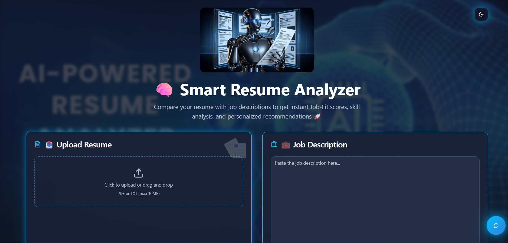
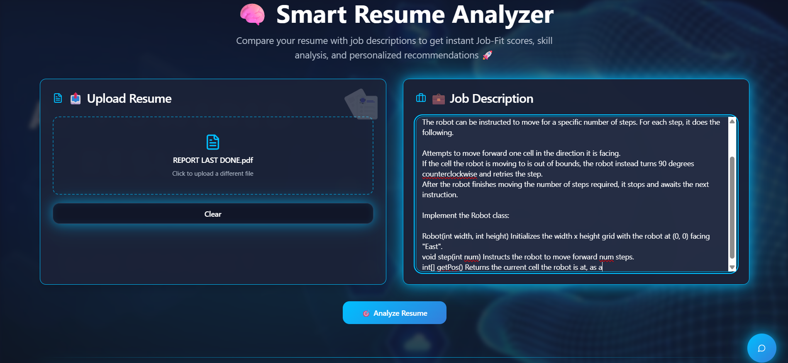
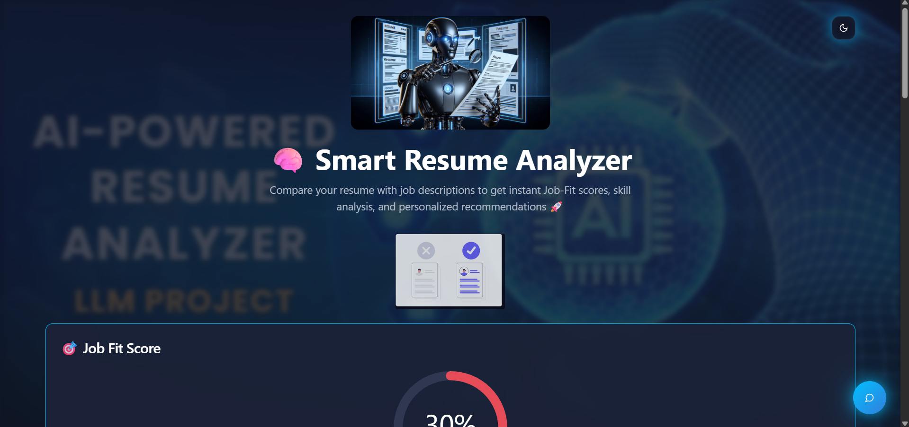
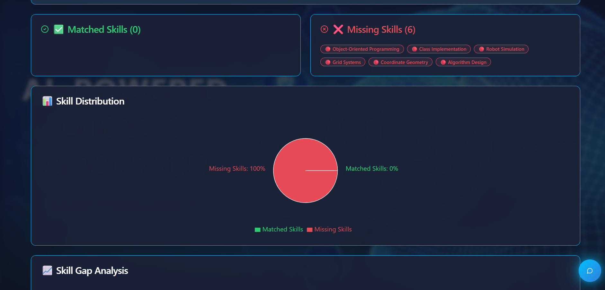
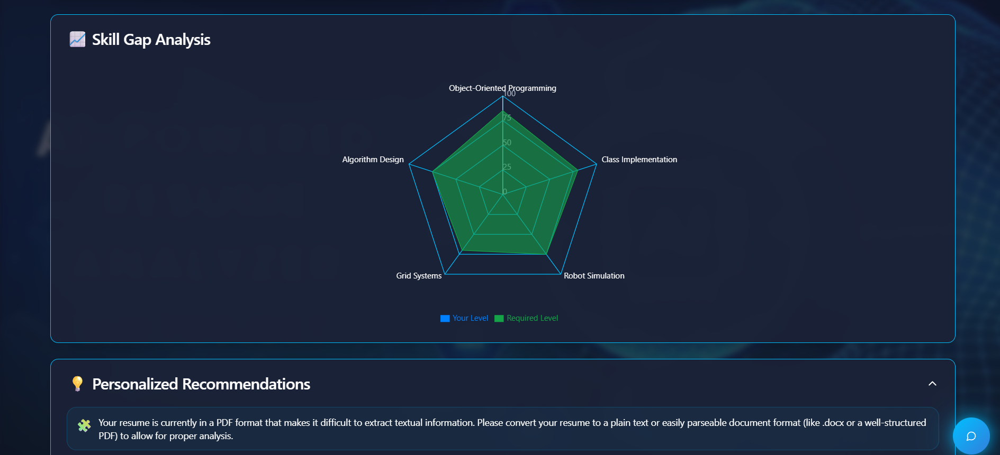
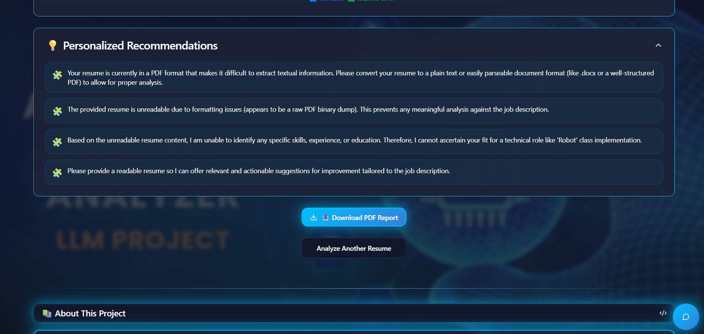
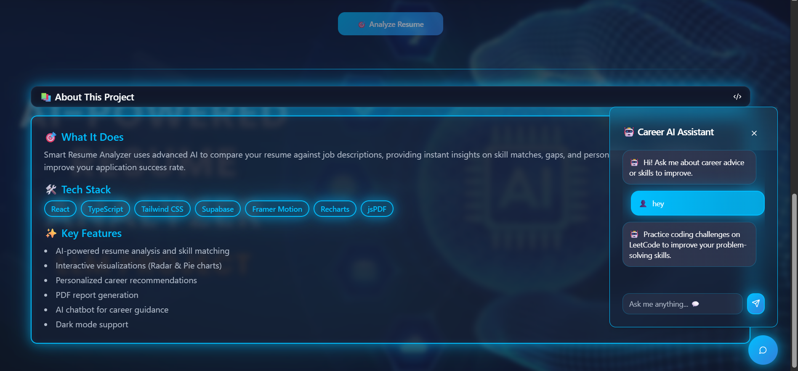

# 🧠 Smart Resume Analyzer AI

An AI-powered web application that analyzes resumes against job descriptions to generate **job-fit scores, skill gap insights, and personalized recommendations**.

---

## 🚀 Overview

Smart Resume Analyzer helps users understand how well their resume matches a job role by:

* Comparing resume with job description
* Identifying missing and matched skills
* Generating insights and recommendations
* Providing visual analytics for better understanding

---

## ✨ Key Features

* 📄 Resume Upload (PDF/TXT)
* 🧾 Job Description Input
* 🎯 Job Fit Score Calculation
* ✅ Matched vs ❌ Missing Skills Detection
* 📊 Skill Gap Analysis (Charts & Graphs)
* 🧠 AI-Based Recommendations (Concept)
* 📥 Downloadable PDF Report
* 🌙 Modern UI with clean design

---

## 🛠️ Tech Stack

* **Frontend:** React + TypeScript + Vite
* **Styling:** Tailwind CSS
* **Charts:** Recharts
* **PDF Generation:** jsPDF
* **Backend:** (Concept-based / not fully integrated)

---

## 📸 Screenshots

### 🖥️ Homepage & Dashboard

  

---

### 📥 Input Section (Resume + Job Description)

  

---

### 📊 Output Result

  

---

### 📈 Output Analysis

  

---

### 📉 Skill Gap Analysis

  

---

### 📄 Download Report Feature

  

---

### 📚 About Project Section

  

---

## ⚠️ Note

This project is currently a **UI + system design demo**.

* AI logic is simulated
* No real backend or ML model integration
* Designed to showcase frontend + product design skills

---

## 🧠 Future Improvements

* Real NLP-based resume parsing
* AI/LLM integration for smart analysis
* Backend API using FastAPI / Node.js
* Real-time scoring system
* Full deployment with database

---

## 🎯 Project Highlights

* Clean and modern UI
* Real-world problem solving approach
* Combines AI + Full Stack concepts
* Strong portfolio-ready project

---

